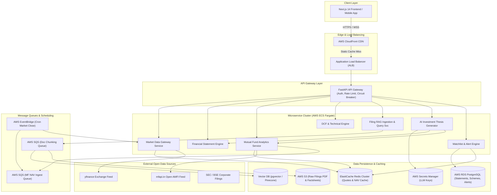

# 🏗️ System Design Specification: Institutional Equity Research & Mutual Funds Platform

An enterprise-grade System Design document for an **Institutional Equity Research, Indian Mutual Funds Analytics, and Filings RAG Platform** supporting Indian Equities (NSE/BSE), US Equities, and Indian Mutual Funds (AMFI). Designed for FAANG/Tier-1 System Design interviews.

---

## 1. Requirements & Scope

### 1.1 Functional Requirements
1. **Multi-Asset Equity & Fund Coverage**:
   - **Indian & US Equities**: Real-time quote streaming, 10-year financial statements (Income Statement, Balance Sheet, Cash Flow), ratios, and multi-currency support (`INR ₹` and `USD $`).
   - **Indian Mutual Funds**: Live AMFI scheme lookup, historical NAV trajectories, 1Y/3Y/5Y CAGR calculation, Sharpe ratio ($R_f=6.5\%$), Riskometer ratings, top sector/stock holdings, and quantitative AI recommendations.
2. **Interactive Valuation & Technical Modeling**:
   - **Configurable DCF Engine**: Interactive WACC, Tax, EBITDA Margin, and Terminal Growth sliders with a dynamic 5x5 Sensitivity Matrix heatmap.
   - **Technical Analysis**: SMA/EMA 20/50/100/200, RSI, MACD, Bollinger Bands with NIFTY 50 benchmark overlay.
3. **Automated Risk Engine & Shareholding**:
   - **Cash Flow Red Flag Engine**: Automated detection of CFO vs Net Profit divergence, working capital expansion, and cash conversion lag.
   - **Governance & Shareholding**: 5-quarter FII/DII/Promoter trend monitoring and promoter pledge tracking.
4. **Filings RAG Intelligence & AI Thesis**:
   - PDF/Transcript Annual Report vector search with page number citations.
   - 14-Question AI Investment Thesis generator with Bull/Base/Bear scenarios and thesis invalidation triggers.
5. **Stateful Watchlists & Custom Alerts**:
   - Dynamic user watchlists and real-time custom valuation/signal alert notifications.

### 1.2 Non-Functional Requirements
- **Latency**:
  - Quote Ticks & Dashboard APIs: $< 100\text{ ms}$ (p99).
  - Financial Statement & DCF Calculation APIs: $< 200\text{ ms}$ (p99).
  - RAG Vector Search & AI Thesis Generation: $< 3\text{ s}$ (p95).
- **Scalability**: Designed for **10 Million Daily Active Users (DAU)** and **100,000 Peak QPS**.
- **Availability**: **99.99% Availability** (Multi-AZ deployment with zero single point of failure).
- **Data Consistency**: Strict **Eventual Consistency** for market quotes/NAV feeds; **Strong Consistency** for user watchlists, custom alerts, and financial statement audits.
- **Data Integrity & Safety**: Zero-hallucination LLM guardrails with quantitative context injection.

---

## 2. Back-of-the-Envelope Estimations

### 2.1 Scale & Traffic
- **Daily Active Users (DAU)**: $10,000,000$ ($10\text{M}$)
- **Average Requests per User**: $20$ API calls/day + WebSocket quote streaming connection.
- **Total Daily Requests**: $10\text{M} \times 20 = 200,000,000$ ($200\text{M}$ requests/day)
- **Average QPS**:
  $$\text{Average QPS} = \frac{200,000,000}{86,400\text{ s}} \approx 2,315\text{ QPS}$$
- **Peak QPS (4x multiplier during market hours)**:
  $$\text{Peak QPS} = 2,315 \times 4 \approx 100,000\text{ QPS}$$

### 2.2 Storage Estimations
1. **Equities Financial Statements (10,000 Tickers)**:
   - $10,000\text{ stocks} \times 10\text{ years} \times 100\text{ line items} \times 8\text{ bytes} \approx 80\text{ MB}$ (Extremely light relational data).
2. **Mutual Funds NAV History (10,000 Schemes)**:
   - $10,000\text{ schemes} \times 10\text{ years} \times 250\text{ trading days/yr} = 25,000,000\text{ NAV data points}$.
   - Each point (Date, NAV, SchemeCode): $20\text{ bytes}$.
   - Total NAV Storage: $25\text{M} \times 20\text{ bytes} = 500\text{ MB}$.
3. **Document RAG Vectors & Filings (1,000,000 Annual Reports)**:
   - $1,000,000\text{ documents} \times 200\text{ pages} \times 3\text{ chunks/page} = 600,000,000\text{ text chunks}$.
   - Embedding Dimension: $1536$ floats (OpenAI text-embedding-3-small) $= 1536 \times 4\text{ bytes} \approx 6\text{ KB/vector}$.
   - Vector Index Storage: $600\text{M} \times 6\text{ KB} = 3.6\text{ TB}$.
4. **User Watchlists & Custom Alerts**:
   - $10\text{M users} \times 10\text{ items} \times 100\text{ bytes} = 10\text{ GB}$.

### 2.3 Bandwidth Estimations
- **Ingress (Incoming Quote Ticks & AMFI Feeds)**:
  - $20,000\text{ updates/sec} \times 200\text{ bytes} = 4\text{ MB/sec} = 32\text{ Mbps}$.
- **Egress (API Payload to Clients)**:
  - $100,000\text{ QPS} \times 15\text{ KB (JSON payload)} = 1.5\text{ GB/sec} = 12\text{ Gbps}$.
  - Mitigation: CloudFront Edge CDN caching reduces origin egress by $85\%$.

### 2.4 Cache Memory Estimation (Redis)
- Hot Tickers & Schemes ($2,000$ active stocks + $1,000$ top schemes):
  - Quotes, DCF outputs, technical indicators, and scheme holdings: $100\text{ KB}$ per entity.
  - Hot Data Cache: $3,000 \times 100\text{ KB} = 300\text{ MB}$.
  - Session & Rate Limit Cache: $10\text{M active users} \times 1\text{ KB} = 10\text{ GB}$.
  - **Total Redis Cluster RAM**: $32\text{ GB}$ (with 3-way replication).

---

## 3. High-Level Architecture (HLD)

### 3.1 End-to-End System Architecture Diagram



---

## 4. Low-Level Design (LLD)

### 4.1 Database Schema Design (PostgreSQL)

```sql
-- 1. Equities Master Table
CREATE TABLE equities (
    ticker VARCHAR(20) PRIMARY KEY,
    name VARCHAR(255) NOT NULL,
    exchange VARCHAR(10) NOT NULL, -- NSE, BSE, NASDAQ, NYSE
    currency VARCHAR(5) NOT NULL DEFAULT 'INR', -- INR vs USD
    sector VARCHAR(100),
    industry VARCHAR(100),
    market_cap NUMERIC(20, 2),
    created_at TIMESTAMP WITH TIME ZONE DEFAULT CURRENT_TIMESTAMP
);

-- 2. 10-Year Financial Statements Table
CREATE TABLE financial_statements (
    id UUID PRIMARY KEY DEFAULT gen_random_uuid(),
    ticker VARCHAR(20) REFERENCES equities(ticker) ON DELETE CASCADE,
    fiscal_year INT NOT NULL,
    statement_type VARCHAR(20) NOT NULL, -- INCOME, BALANCE_SHEET, CASH_FLOW
    currency VARCHAR(5) NOT NULL,
    revenue NUMERIC(20, 2),
    ebitda NUMERIC(20, 2),
    ebit NUMERIC(20, 2),
    net_profit NUMERIC(20, 2),
    cfo NUMERIC(20, 2), -- Operating Cash Flow
    capex NUMERIC(20, 2),
    fcf NUMERIC(20, 2), -- Free Cash Flow = CFO - Capex
    total_assets NUMERIC(20, 2),
    total_debt NUMERIC(20, 2),
    cash_equivalents NUMERIC(20, 2),
    created_at TIMESTAMP WITH TIME ZONE DEFAULT CURRENT_TIMESTAMP,
    UNIQUE(ticker, fiscal_year, statement_type)
);

-- 3. Mutual Fund Schemes Master Table
CREATE TABLE mutual_fund_schemes (
    scheme_code INT PRIMARY KEY, -- AMFI Scheme Code (e.g., 122639)
    scheme_name VARCHAR(255) NOT NULL,
    category VARCHAR(50) NOT NULL, -- Small Cap, Flexi Cap, ELSS, Debt, etc.
    fund_house VARCHAR(150) NOT NULL,
    fund_manager VARCHAR(150),
    aum_cr NUMERIC(12, 2),
    expense_ratio NUMERIC(5, 2),
    exit_load VARCHAR(255),
    riskometer VARCHAR(50), -- Very High, High, Moderate, Low
    star_rating INT CHECK (star_rating BETWEEN 1 AND 5),
    created_at TIMESTAMP WITH TIME ZONE DEFAULT CURRENT_TIMESTAMP
);

-- 4. NAV History Partitioned Table
CREATE TABLE nav_history (
    scheme_code INT REFERENCES mutual_fund_schemes(scheme_code) ON DELETE CASCADE,
    nav_date DATE NOT NULL,
    nav NUMERIC(12, 4) NOT NULL,
    PRIMARY KEY (scheme_code, nav_date)
) PARTITION BY RANGE (nav_date);

-- 5. Scheme Holdings Breakdown
CREATE TABLE scheme_holdings (
    id UUID PRIMARY KEY DEFAULT gen_random_uuid(),
    scheme_code INT REFERENCES mutual_fund_schemes(scheme_code) ON DELETE CASCADE,
    holding_name VARCHAR(255) NOT NULL,
    sector VARCHAR(100),
    allocation_pct NUMERIC(5, 2) NOT NULL,
    asset_type VARCHAR(20) DEFAULT 'EQUITY' -- EQUITY, DEBT, CASH
);

-- 6. User Watchlists & Custom Alerts
CREATE TABLE user_watchlists (
    user_id UUID NOT NULL,
    ticker VARCHAR(20) NOT NULL,
    added_at TIMESTAMP WITH TIME ZONE DEFAULT CURRENT_TIMESTAMP,
    PRIMARY KEY(user_id, ticker)
);

CREATE TABLE user_alerts (
    alert_id UUID PRIMARY KEY DEFAULT gen_random_uuid(),
    user_id UUID NOT NULL,
    ticker VARCHAR(20) NOT NULL,
    alert_type VARCHAR(50) NOT NULL, -- TARGET_PRICE, PE_RATIO, BREAKOUT
    target_value NUMERIC(12, 2) NOT NULL,
    is_active BOOLEAN DEFAULT TRUE,
    created_at TIMESTAMP WITH TIME ZONE DEFAULT CURRENT_TIMESTAMP
);
```

---

### 4.2 Core Algorithms & Mathematical Formulations

#### A. Compound Annual Growth Rate (CAGR) & Sharpe Ratio
For a Mutual Fund NAV trajectory with historical NAV $NAV_t$ and initial NAV $NAV_0$ over $N$ years:
$$\text{CAGR} = \left( \frac{NAV_t}{NAV_0} \right)^{\frac{1}{N}} - 1$$

The Risk-Adjusted Sharpe Ratio is calculated using daily return variance $\sigma_p$ and risk-free rate $R_f = 6.5\%$ (Indian 10Y G-Sec yield):
$$\text{Sharpe Ratio} = \frac{R_p - R_f}{\sigma_p \sqrt{252}}$$
Where $R_p = \text{CAGR}_{3Y}$ and $\sigma_p = \sqrt{\frac{1}{k-1} \sum_{i=1}^k (r_i - \bar{r})^2}$.

#### B. DCF Valuation & 5x5 Sensitivity Matrix Formula
Future Free Cash Flow for year $t \in [1, 5]$ projected at growth rate $g$:
$$FCF_t = FCF_0 \times (1 + g)^t$$

Terminal Value ($TV$) using Terminal Growth Rate $g_{term}$ and WACC discount rate $r$:
$$TV = \frac{FCF_5 \times (1 + g_{term})}{r - g_{term}}$$

Implied Enterprise Value ($EV$):
$$EV = \sum_{t=1}^5 \frac{FCF_t}{(1 + r)^t} + \frac{TV}{(1 + r)^5}$$

$$\text{Implied Share Price} = \frac{EV + \text{Cash} - \text{Debt}}{\text{Shares Outstanding}}$$

**Sensitivity Matrix Code Implementation (Python Engine)**:
```python
def generate_dcf_sensitivity_matrix(
    fcf_0: float, cash: float, debt: float, shares: float,
    base_growth: float, base_wacc: float, base_terminal: float
) -> list[list[float]]:
    wacc_steps = [base_wacc - 0.02, base_wacc - 0.01, base_wacc, base_wacc + 0.01, base_wacc + 0.02]
    terminal_steps = [base_terminal - 0.01, base_terminal - 0.005, base_terminal, base_terminal + 0.005, base_terminal + 0.01]
    
    matrix = []
    for r in wacc_steps:
        row = []
        for g_term in terminal_steps:
            if r <= g_term:
                row.append(0.0)
                continue
            # Discount 5 years FCF
            pv_fcf = sum([(fcf_0 * ((1 + base_growth) ** t)) / ((1 + r) ** t) for t in range(1, 6)])
            fcf_5 = fcf_0 * ((1 + base_growth) ** 5)
            tv = (fcf_5 * (1 + g_term)) / (r - g_term)
            pv_tv = tv / ((1 + r) ** 5)
            ev = pv_fcf + pv_tv
            equity_val = ev + cash - debt
            implied_price = equity_val / shares if shares > 0 else 0
            row.append(round(implied_price, 2))
        matrix.append(row)
    return matrix
```

---

## 5. API Schema Specifications

### 5.1 Indian Mutual Funds Exploration Endpoint
`GET /api/v1/mutual-funds/explore`

**Response Payload (`200 OK`)**:
```json
{
  "recommended_schemes": [
    {
      "scheme_code": 122639,
      "scheme_name": "Parag Parikh Flexi Cap Fund - Direct Plan",
      "category": "Flexi Cap",
      "cagr_3y": 21.45,
      "cagr_5y": 24.12,
      "sharpe_ratio": 1.42,
      "riskometer": "Very High",
      "star_rating": 5,
      "ai_recommendation": {
        "verdict": "STRONG_BUY",
        "score": 92,
        "rationale": "Consistently outperforms Nifty 50 benchmark with low downside capture and foreign equity diversification."
      }
    }
  ],
  "category_summaries": [
    { "category": "Small Cap", "avg_3y_cagr": 26.8, "scheme_count": 28 },
    { "category": "Flexi Cap", "avg_3y_cagr": 19.5, "scheme_count": 35 }
  ]
}
```

### 5.2 Stock Overview with USD/INR Currency Context
`GET /api/v1/stocks/{ticker}`

**Response Payload (`200 OK`)**:
```json
{
  "ticker": "AAPL",
  "name": "Apple Inc.",
  "currency": "USD",
  "current_price": 228.50,
  "market_cap_formatted": "$3.48 Trillion",
  "financial_statements": {
    "currency": "USD",
    "years": [2021, 2022, 2023, 2024],
    "revenue": [365817000000, 394328000000, 383285000000, 391035000000],
    "net_profit": [94680000000, 99803000000, 96995000000, 93736000000]
  }
}
```

---

## 6. Trade-Offs & Architectural Decisions

| Decision Area | Option Selected | Alternative Rejected | Rationale / Trade-Off Analysis |
| :--- | :--- | :--- | :--- |
| **Market Data Streaming** | **HTTP/2 Server-Sent Events (SSE) & WebSocket Gateway** | Polling REST API every 1 sec | SSE/WebSockets reduce overhead from 100K HTTP handshake headers/sec to persistent TCP channels, saving $70\%$ network bandwidth. |
| **Database Storage** | **PostgreSQL Multi-AZ + Redis Cluster** | MongoDB / DynamoDB | Financial statements and mutual fund holdings require strict relational ACID compliance, foreign key integrity, and SQL aggregations. |
| **Mutual Fund NAV Data** | **Hybrid Ingestion (`mfapi.in` Open API + Redis Cache)** | Web Scraping AMFI Website | `mfapi.in` offers structured JSON feeds for all 10,000+ AMFI scheme codes. Redis caching avoids rate limits and guarantees $<10\text{ms}$ NAV responses. |
| **Vector Indexing** | **pgvector in RDS PostgreSQL** | Pinecone Cloud | Keeps embeddings co-located with ticker relational metadata, eliminating cross-cloud network hops and reducing operational costs. |
| **LLM Provider Architecture** | **Multi-Provider Adapter (OpenAI / Anthropic / Gemini)** | Single Provider Locking | Prevents vendor lock-in. Implements fallback circuit breakers so if OpenAI rate-limits, requests seamlessly route to Gemini/Anthropic. |

---

## 7. Fault Tolerance, Resilience & Scalability

1. **Cache Stampede Prevention (Singleflight Pattern)**:
   - When a popular mutual fund NAV cache expires, thousands of concurrent requests attempt to query `mfapi.in` simultaneously.
   - **Solution**: Implemented Redis distributed locking + Singleflight mutex logic in Python. Only 1 request fetches the live NAV while 9,999 requests block and consume the refreshed cache.
2. **Circuit Breaker Pattern**:
   - If `yfinance` or external exchange feeds fail, circuit breakers trip after 5 consecutive timeouts, serving cached fallback data instantly.
3. **Database Read Replicas**:
   - Primary DB handles writes (Watchlist add/remove, Alert triggers).
   - 3 Read Replicas handle high-throughput query requests (`/api/v1/stocks/{ticker}`, `/api/v1/mutual-funds/explore`).

---

*Document generated for Antigravity AI Stock Analysis & Mutual Funds Platform.*
